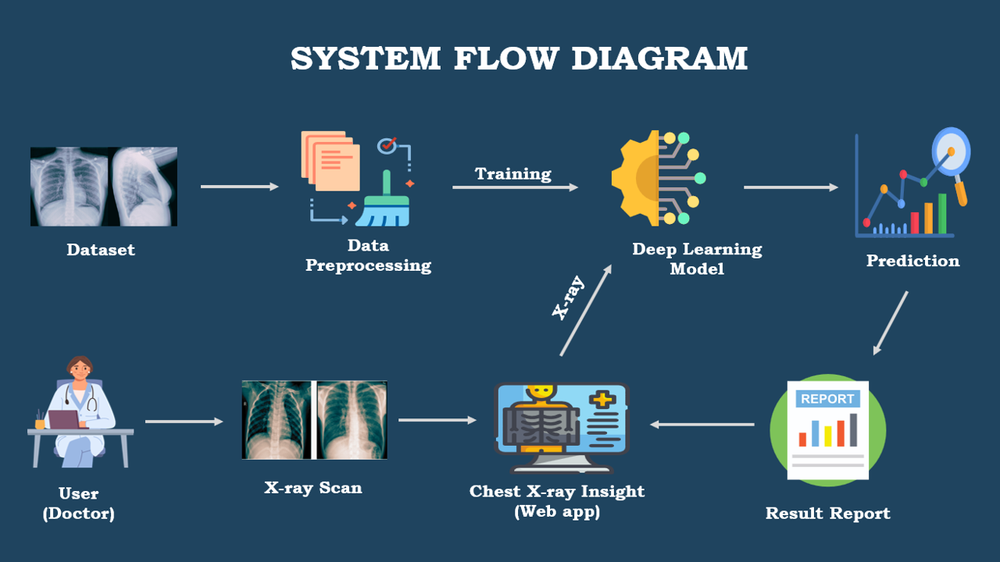

# 🫁 Chest X-Ray Disease Detection System

A deep learning-powered web application that classifies chest X-ray images into **4 disease categories** using the **Xception** architecture with **Grad-CAM** heatmap visualization.

> **🌟 Try the Live Demo:** [**Chest X-Ray Detector on Hugging Face**](https://huggingface.co/spaces/Hamzasajjad38/Chest-Xray-Detector)

## 🩺 Disease Categories
- ✅ **Normal** — Healthy lungs
- 🦠 **Covid-19** — COVID-19 infection
- 💨 **Pneumonia** — Bacterial/Viral Pneumonia
- 🧬 **Tuberculosis** — TB infection

## 🚀 How to Use the Live App
1. Go to our [Hugging Face Space](https://huggingface.co/spaces/Hamzasajjad38/Chest-Xray-Detector)
2. Click on **"Detector Tool"** in the navigation bar
3. Upload a chest X-ray image (PNG, JPG, JPEG)
4. Click **"Analyze"**
5. View the predicted diagnosis + **Grad-CAM heatmap** showing which areas the model focused on!

## 🤖 Model Details
Because the trained model file (`best_model.keras`) is 241 MB, it exceeds GitHub's file size limit. The model is hosted securely using Git LFS on our Hugging Face Space.

| Property | Details |
|---|---|
| Architecture | Xception (Transfer Learning) |
| Input Size | 299 × 299 pixels |
| Classes | 4 (Covid-19, Normal, Pneumonia, Tuberculosis) |
| Explainability | Grad-CAM Heatmap |
| Test Accuracy | 98.81% |

## ⚙️ Process Flow

## 📦 Dataset
The model was trained on a custom combined dataset (8.4 GB) available on Kaggle:

🔗 **[Chest X-Ray Image Dataset — Kaggle](https://www.kaggle.com/datasets/mmuneer/chest-x-ray-image-dataset)**

| Split | Images per Class | Total |
|---|---|---|
| Training | 3,000 × 4 classes | 12,000 |
| Testing | 900 × 4 classes | 3,600 |

## 🏗️ Tech Stack
- **Backend**: Python, Flask
- **Deep Learning**: TensorFlow / Keras (Keras 3 / TF 2.16 Compatible)
- **Model**: Xception (pre-trained on ImageNet, fine-tuned)
- **Explainability**: Grad-CAM
- **Frontend**: HTML, CSS, JavaScript
- **Deployment**: Docker, Hugging Face Spaces

## 👥 Team
This project was developed as a **Final Year Project (FYP)** by:
- Hamza Sajjad
- Muneer
- Asna
- Shanza

## ⚠️ Disclaimer
This tool is for **educational and research purposes only**. It is **NOT** a substitute for professional medical diagnosis. Always consult a qualified medical professional for health-related decisions.

## 📄 License
MIT License — feel free to use and modify with attribution.
